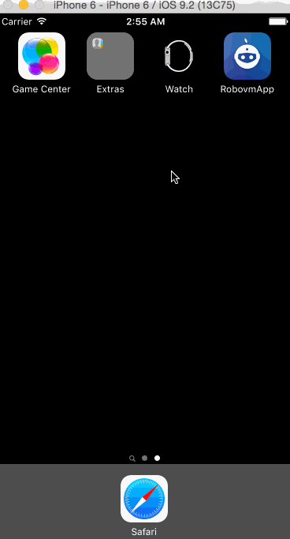

RoboVM iOS App in Kotlin
========================

  Native iOS app in [kotlin](https://kotlinlang.org/) using [mobidevelop](http://robovm.mobidevelop.com/) RoboVM fork.


### Run

```ruby
$ git clone https://github.com/sureshg/RobovmKotlinApp.git
$ cd RobovmKotlinApp
$ ./gradlew clean build launchIPhoneSimulator
```




